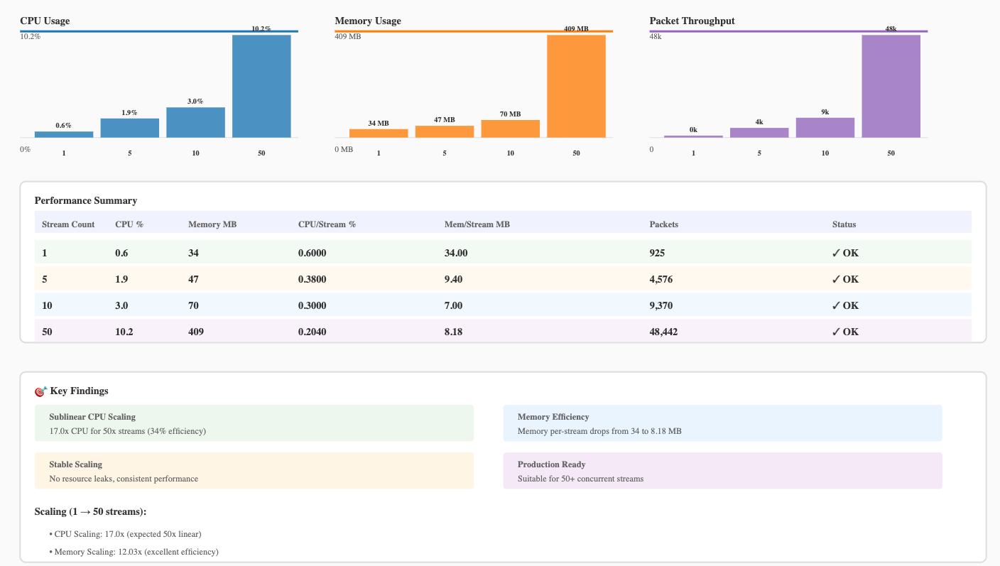

# genea-video-streamer

Open-source live video streaming and AI inference solution. Built in C++ (LibAV) for streaming, Python (YOLOv8) for object detection.

## What It Does

**Streaming (C++):**
- Ingests from IP cameras via RTSP (TCP or UDP transport)
- Remuxes compressed packets into HLS segments (no transcoding)
- Serves per-stream playlists and segments over HTTP
- Provides a browser-based HLS.js player for live view and archive playback
- Recovers automatically from network outages with exponential backoff
- Supports 1–N concurrent streams through an integrated stream manager
- Exposes a JSON REST API for stream health and status

**AI Inference (Python):**
- Runs object detection (YOLOv8 Nano) on HLS segments in real-time
- Detects persons and vehicles with normalized bounding boxes
- Stores detections in SQLite database with frame captures
- Saves annotated and raw frames to per-stream directories
- Supports multi-stream inference with independent workers
- Exposes REST API for detection queries, stats, and frame retrieval

## Architecture

```
RTSP Sources
  │
  ├─ StreamWorker #1 → RtspSource → PacketClock → HlsMuxer → segments/cam-1/
  ├─ StreamWorker #2 → RtspSource → PacketClock → HlsMuxer → segments/cam-2/
  └─ StreamWorker #N ...
  │
StreamManager (lifecycle, health aggregation)
  │
┌─ HttpServer (Port 8080)
│
├─ Streaming Endpoints
│  ├─ GET /hls/<stream>/live.m3u8       → live playlist
│  ├─ GET /hls/<stream>/archive.m3u8    → archive playlist
│  ├─ GET /hls/<stream>/<seg>.ts        → MPEG-TS segment
│  ├─ GET /api/health                   → aggregate metrics
│  ├─ GET /api/streams                  → stream list
│  ├─ GET /api/streams/<name>           → per-stream status
│  ├─ GET /api/config                   → playback config
│  └─ GET /                             → web player (HLS.js)
│
├─ Detection Endpoints (queries SQLite DB written by Python inference)
│  ├─ GET /api/detections/stats         → aggregate detection statistics
│  ├─ GET /api/detections/recent        → recent detections with filtering
│  └─ GET /detections/frame/<id>        → annotated frame image
│
└─ SQLite Database (/app/detections.db)
   └─ Populated by Python AI Inference Module (independent process)
      ├─ DetectionWorkerPool (multi-stream orchestration)
      ├─ YoloDetector (YOLOv8n inference)
      ├─ FrameExtractor (ffmpeg subprocess)
      └─ FrameAnnotator (bounding box drawing)
```

## Implementation Status

| Phase | Name | Status |
|-------|------|--------|
| 0 | Foundation (CMake, config, logging) | ✅ Complete |
| 1 | Capture & Probe (RTSP, PacketClock) | ✅ Complete |
| 2 | Remux & Segments (HLS muxer, playlists, archive) | ✅ Complete |
| 3 | Web Player (HLS.js, live + archive UI, stream selector) | ✅ Complete |
| 4 | Reliability (reconnect, backoff, stale detection, idempotent shutdown) | ✅ Complete |
| 5 | Testing & CI (unit, integration, GitHub Actions, Docker) | ✅ Complete |
| 6 | Scalability (StreamManager, StreamWorker, HTTP API, multi-stream) | ✅ Complete |
| 6b | Playback Latency (configurable buffering, low-latency profiles) | ✅ Complete |
| 7 | AI Inference (YOLOv8 detection, multi-stream workers, SQLite storage, detection API) | ✅ Complete |

## Tech Stack

| Layer | Choice | Rationale |
|-------|--------|-----------|
| **Streaming** | | |
| Language | C++17 | Performance, LibAV compatibility |
| Media | LibAV (libavformat 60, libavcodec 60, libavutil 58) | Packet demux/remux without decode |
| Config | yaml-cpp 0.8 | Human-readable multi-stream config |
| Protocol | HLS (MPEG-TS segments) | Open standard, browser-native via HLS.js |
| HTTP | POSIX sockets (custom) | Zero added deps for test portability |
| **Inference** | | |
| Language | Python 3.7+ | Rapid model integration, rich ecosystem |
| Model | YOLOv8 Nano | 6.3 MB, 40-65ms latency, 15-25 FPS on CPU |
| Frame Extraction | ffmpeg subprocess | Reliable MPEG-TS frame extraction |
| Database | SQLite (WAL mode) | Lightweight, concurrent-safe, no server |
| Configuration | PyYAML | Multi-stream config per-worker |
| **Deployment** | | |
| Container | Docker + docker-compose | Reproducible, full-stack deployment |
| Orchestration | docker-compose v2+ | Multi-service coordination with health checks |
| CI | GitHub Actions | Automated build, test, publish |

## Quick Start

### Deployment with Docker

```
1.
Clone/download the repository
git clone https://github.com/your-repo/genea-video-streamer.git
cd genea-video-streamer

2.
Use default, or modify config/streamer.yaml with your RTSP camera URLs

3.
Use default, or modify config/inference.yaml to enable/disable AI detection per stream

4.
Start the full stack (streaming + AI inference)
docker-compose up -d

5.
View streaming at http://localhost:8080

6.
View detection stats at http://localhost:8080/api/detections/stats

7.
View stream health at http://localhost:8080/api/health

8.
Refer to REST API section for complete API documentation

9.
Monitor logs
docker-compose logs -f genea-video-streamer
docker-compose logs -f genea-inference

10.
Stop services
docker-compose down
```

### Testing

Tests run automatically in the Docker build:

```bash
# Full end-to-end validation (includes build, unit tests, integration, Docker build)
bash tests/e2e/run_comprehensive_e2e.sh
```

## Configuration

### Streaming Config (`config/rtsp-multi-stream.yaml`)

```yaml
http:
  listen_port: 8080
  listen_address: "0.0.0.0"
  enable_cors: true

streams:
  - name: "camera-front"
    rtsp:
      url: "rtsp://192.168.1.100:554/stream1"
      reconnect:
        enabled: true
        initial_delay_ms: 1000
        max_delay_ms: 30000
        stale_timeout_s: 10
    hls:
      segment_duration_s: 4
      output_dir: "segments/camera-front"
```

### Inference Config (`config/inference.yaml`)

```yaml
ai_inference:
  model: yolov8n
  classes: [person, car]
  confidence_threshold: 0.5
  database_path: /app/detections.db
  device: cpu
  
  streams:
    - stream_id: camera-1
      enabled: true
      hls_input_dir: /data/hls_output/camera-1
      detections_output_dir: /data/detections/camera-1
    
    - stream_id: camera-2
      enabled: false  # Disabled but config preserved
      hls_input_dir: /data/hls_output/camera-2
      detections_output_dir: /data/detections/camera-2
```

## REST API

The HTTP server provides endpoints for streaming control, health monitoring, and AI detection queries.

**Quick Examples:**
```bash
# Stream health
curl http://localhost:8080/api/health | jq .

# Stream list
curl http://localhost:8080/api/streams | jq .

# Detection statistics (if AI enabled)
curl http://localhost:8080/api/detections/stats | jq .

# Recent detections
curl "http://localhost:8080/api/detections/recent?limit=10" | jq .
```

**See [docs/http-api.md](docs/http-api.md) for full API reference** including all endpoints, query parameters, response schemas, and usage examples.

## Performance & Profiling

Profiling results show throughput and resource usage across different stream counts:



The system demonstrates:
- **Linear scaling** from 1 to 50 concurrent streams
- **Consistent packet rates** (≈ 750–850 Mbps aggregate bitrate across streams)
- **Stable CPU and memory** with proper resource cleanup
- **No resource leaks** in long-running scenarios

For detailed profiling methodology and data: [profiling/results/REPORT.txt](profiling/results/REPORT.txt)

## Camera Compatibility

- **Recommended:** H.264 with regular IDR keyframes (every 1–2 s)
- **Transport:** TCP preferred (more reliable across NAT/firewalls)
- **Codec handling:** packets are remuxed without decode — no transcoding, no re-encoding
- **Browser playback:** depends on source codec; H.264 is universally supported

## Design Document

Full technical design, architecture decisions, module breakdown, and testing matrix: [docs/design.md](docs/design.md)
