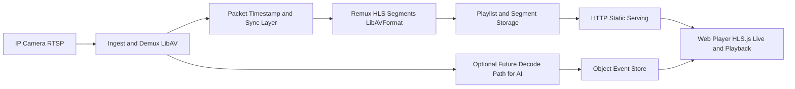

# Genea Live Video Streaming Solution - Technical Design

## 1. Scope and Objective

Build an open-source live video streaming pipeline in C++ (LibAV/FFmpeg libraries) that:

1. Captures from IP camera using RTSP only.
2. Streams to a destination server.
3. Provides a web player for live view and playback.
4. Handles network interruptions gracefully.
5. Is testable, maintainable, and scalable.

Implementation limitation for this version:

1. No transcoding/encoding.
2. Stream is forwarded by compressed packet copy/remux.
3. Compatibility is constrained by camera codec and keyframe cadence.

Optional layers (after core delivery): AI inference, object search, and performance optimization.

## 1.1 Engineering Principles

1. Keep the project as simple and human-readable as possible.
2. Avoid premature optimization at every stage.
3. Implement and validate one small step at a time.
4. Favor clear behavior and operability before advanced features.

## 2. Priority-Ordered Implementation Plan

The work is intentionally sequenced so each phase is runnable and demonstrable.

### Phase 0 - Project Foundation (Priority 0)

Deliverables:

1. CMake-based C++ project skeleton.
2. Third-party integration notes for LibAV libs.
3. Configuration model (YAML or JSON) for source/output/player settings.
4. Basic logging utility and error code conventions.

Why first:

- Enables all later modules to be built and tested quickly.

### Phase 1 - Capture and Probe (Priority 1)

Deliverables:

1. `VideoSource` abstraction with one implementation:
	 - `RtspSource` via network input.
2. Probe utility that prints stream metadata (codec, fps, resolution, time base).
3. Packet read loop (compressed `AVPacket`) with timestamp normalization for remux.

Why second:

- Proves deterministic RTSP ingest and confirms codec compatibility before remux.

### Phase 2 - Remux and Segment Output (Priority 2)

Deliverables:

1. Packet remux pipeline (`libavformat`) writing HLS segments (`.ts`) and playlist (`.m3u8`).
2. Codec parameter copy from input stream to output stream.
3. Timestamp rescale and continuity handling for playlist stability.
4. Rolling live window plus archive playlist for playback.

Why third:

- Satisfies live stream plus playback requirement with open protocol (HLS) while preserving source codec.

### Phase 3 - Delivery and Web Player (Priority 3)

Deliverables:

1. Static player page with HLS.js:
	 - live playback from live playlist.
	 - seek/playback from archive playlist.
2. HTTP serving strategy:
	 - recommended: Nginx (simple, robust static serving).
	 - optional: lightweight built-in server for local demo.
3. End-to-end demo command from source to browser.

Why fourth:

- Completes functional assignment outcome visible to evaluator.

### Phase 4 - Reliability and Outage Handling (Priority 4)

Deliverables:

1. RTSP reconnect loop with exponential backoff.
2. Stale-source detection (no frames for N seconds).
3. Segment continuity policy after reconnect:
	 - preserve monotonic packet timestamps.
	 - emit discontinuity marker in playlist when required.
4. Health metrics endpoint/log dump (packets in/out, reconnect count).

Why fifth:

- Directly targets reliability evaluation criteria.

### Phase 5 - Testing and Quality Gates (Priority 5)

Deliverables:

1. Unit tests for config parsing, timestamp math, retry policy.
2. Integration tests using sample RTSP/video files.
3. Failure scenario tests (network interruption, malformed source, disk pressure).
4. CI workflow for build + tests + lint checks.

Why sixth:

- Ensures reproducibility and code quality proof.

### Phase 6 - Scalability Hooks (Priority 6)

Deliverables:

1. Multi-pipeline manager (one pipeline per stream).
2. Threading model and resource isolation.
3. Horizontal scale pattern documentation (multiple streamer instances).
4. Future support for distributed segment/object storage.

Why seventh:

- Provides clear path to scale while preserving single-stream MVP simplicity.

### Phase 7 - Optional AI/Search/Optimization (Priority 7)

Deliverables:

1. Optional inference worker (ONNX Runtime/OpenVINO/TensorFlow Lite).
2. Event extraction (`person`, `car`) with timestamp/segment IDs.
3. Query API for object search over event index.
4. Profiling and bottleneck optimization report.

Why last:

- Keeps core stream reliability first; optional features layered cleanly.

## 3. Core Architecture



## 4. Module-Level Design

### 4.1 App Layer

- `main.cpp`
	- parses config.
	- wires pipeline.
	- installs signal handlers for graceful shutdown.

- `PipelineController`
	- owns lifecycle: `init()`, `start()`, `stop()`.
	- coordinates source, remuxer, monitor.

### 4.2 Capture Layer

- `ISource`
	- `open()` / `readPacket()` / `close()`.

- `LibAvInputSource`
	- wraps `AVFormatContext`.
	- handles option dictionaries (RTSP transport, timeouts).

### 4.3 Processing Layer

- `PacketClock`
	- computes monotonic packet PTS/DTS in output time base.

- `PacketGatePolicy`
	- optional packet gating on severe jitter to preserve output continuity.

### 4.4 Remux Layer

- `StreamCopyPlanner`
	- validates source stream codec/container compatibility.
	- decides if stream is accepted for direct remux.

- `HlsMuxer`
	- writes compressed packets without re-encoding.
	- writes segments and playlists.
	- supports configurable segment duration and playlist window.
	- emits VOD/archive playlist snapshots for playback.

### 4.5 Reliability Layer

- `ReconnectPolicy`
	- exponential backoff with max cap and jitter.

- `PipelineHealth`
	- counters and moving averages.
	- periodic logs for observability.

### 4.6 Web Layer

- `web/player.html`
	- live and archive mode switch.
	- playback controls and stream health indicator.
	- clear error state for unsupported codec in browser.

## 5. Suggested Repository Layout

```text
.
├── CMakeLists.txt
├── README.md
├── docs/
│   └── design.md
├── config/
│   └── local-rtsp.yaml
├── src/
│   ├── app/
│   ├── capture/
│   ├── mux/
│   ├── reliability/
│   ├── util/
│   └── main.cpp
├── include/
│   └── streamer/
├── web/
│   ├── player.html
│   └── player.js
├── scripts/
│   ├── run_local_demo.sh
│   └── serve_hls.sh
└── tests/
		├── unit/
		└── integration/
```

## 6. Protocol and Delivery Choices

Primary protocol choice:

1. Ingest: RTSP (IP cameras).
2. Playback delivery: HLS (open, browser-friendly via HLS.js).
3. Container: MPEG-TS segments for broad compatibility.
4. Codec handling: input codec is copied into output (no transcoding).

Rationale:

- Full open-source toolchain.
- Low CPU footprint because no encoding path.
- Easy deployment with static file serving.

Operational constraints:

1. Browser support depends on incoming codec profile.
2. For strongest compatibility, camera should output H.264 with regular IDR frames.
3. We cannot fix problematic source bitrate/GOP/profile in this version because encoding is disabled.

## 7. Network Outage Strategy

1. Detect source timeout (no packets/frames within threshold).
2. Transition pipeline to reconnect mode.
3. Retry with exponential backoff and bounded max interval.
4. Resume stream with timeline continuity controls.
5. Expose reconnect counters and last successful frame timestamp.

## 8. Scalability Strategy

Single-stream MVP first, then multi-stream:

1. One process, one pipeline, one stream (baseline).
2. One process, N pipelines (thread-per-pipeline).
3. Multi-instance deployment behind edge HTTP/server tier.
4. Optional separation of ingest/transcode from distribution tier.

Resource scaling knobs:

- number of concurrent RTSP pipelines.
- segment duration/window size.
- camera-side stream profile/bitrate/GOP configuration.
- inference interval/frame skipping (optional AI).

## 9. Testing Matrix

Functional tests:

1. RTSP source to HLS playable in browser.
2. Source codec compatibility validation behavior.
3. Archive playback seek over recorded window.

Failure tests:

1. Source disconnect and reconnect.
2. Corrupt RTSP packet handling.
3. Disk write pressure behavior.

Performance tests:

1. End-to-end latency estimate.
2. CPU and memory profile at target fps.
3. Segment generation stability over long runs.

## 10. Implementation Plan Aligned with Evaluation Criteria

This plan is structured to address Genea's interview assignment requirements and evaluation criteria within a one-week deadline.

### Critical Path: Phases 0–5 (Core Functionality)
**Target completion:** 5–6 days  
**Delivers:** Working end-to-end stream with reliability and test coverage.

| Phase | Name | Deliverables | PDF Alignment | Est. Time |
|-------|------|--------------|---------------|-----------|
| **0** | Foundation | CMake, config (YAML), logging, error conventions | Code Quality | 0.5 days |
| **1** | Capture & Probe | RTSP source, stream metadata, packet clock | Video Capture, Code Quality | 1 day |
| **2** | Remux & Segments | HLS muxer, playlist (live + archive), codec copy | Streaming Protocol, Functionality | 1.5 days |
| **3** | Web Player | HLS.js player, live/archive UI, HTTP serving | Web Player, Functionality | 1 day |
| **4** | Reliability | Reconnect + backoff, health metrics, stale detection | Network Outage Handling, Reliability | 1 day |
| **5** | Testing & CI | Unit/integration tests, build + lint checks | Testing, Code Quality | 1 day |

**Subtotal: 5–5.5 days** → leaves 1.5–2 days for polish, documentation, and unforeseen issues.

---

### Extended Phases: Phases 6–7 (Scalability & Optional)
**If time permits after Phase 5:**

| Phase | Name | Deliverables | PDF Alignment | Priority |
|-------|------|--------------|---------------|----------|
| **6** | Scalability | Multi-pipeline manager, thread pool, per-stream isolation | Scalability | Medium |
| **7** | AI/Optional | Object detection (ONNX/OpenVINO), event index, search API | Optional Task | Low |

**Note:** Phases 6–7 are deferred unless Phases 0–5 complete ahead of schedule.

---

### Known Gaps & Optional Additions

| Requirement | Status | Priority | Approach |
|-------------|--------|----------|----------|
| AWS Kinesis Video Streams | Not in Phases 0–7 | Optional | If requested: add Phase 2.5 (AWS integration) after Phase 2 |
| Docker / Deployment | Partial (demo scripts) | Low | Phase 3.5: Dockerfile + docker-compose.yml (optional) |
| Design Doc for Evaluator | Partial (internal design.md) | Medium | Phase 5: Polish design doc + create ARCHITECTURE.md summary |

---

### Evaluation Criteria Mapping

| Criterion | Phases | Key Deliverables |
|-----------|--------|-------------------|
| **Functionality** | 1–3 | RTSP → HLS → browser working end-to-end |
| **Code Quality** | 0–5 | Clean architecture, error handling, logging, comments |
| **Reliability** | 4 | Reconnect logic, stale detection, health metrics, graceful shutdown |
| **Scalability** | 6 | Multi-pipeline manager, thread-safe design documented |
| **Testing** | 5 | Unit tests (config, timestamps, reconnect), integration tests |
| **Documentation** | 0–5 | README (setup/run), design.md (architecture), inline code comments |

---

### Immediate Build Sequence (What to Implement First)

*Currently completed (Phases 0–1):*
1. ✅ Create project skeleton and CMake with LibAV linkage.
2. ✅ Implement config loader and logger.
3. ✅ Implement RTSP input + metadata probe tool.
4. ✅ Implement compressed packet ingest and timestamp normalization for remux.

*Next (Phase 2):*
5. 🔄 Implement stream copy HLS remux.

*Then (Phases 3–5):*
6. Add minimal web player and local serving script.
7. Add reconnect/retry and health logging.
8. Add unit/integration tests and CI.

*Deferred (Phases 6–7):*
9. Add optional multi-pipeline scalability.
10. Add optional inference/event search modules.

This sequence maximizes demonstrable progress early (end-to-end streaming by day 3–4), validates reliability and quality (day 5–6), and preserves time for polish or optional enhancements.
